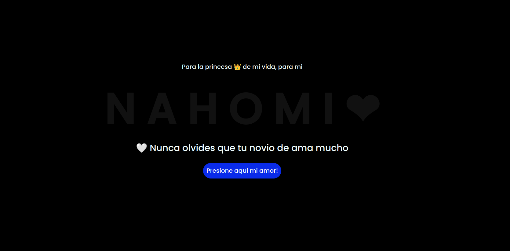
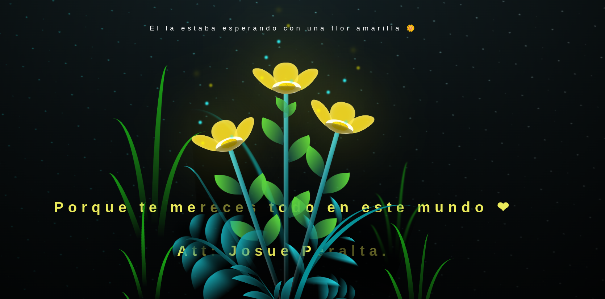

# 🌻 Página Animada de Entrega de Flores Amarillas 🌻

> **Creador:** Josue Peralta  
> **Fecha de creación:** 21 de septiembre de 2024  

## Introducción

El 21 de septiembre es una fecha especial que marca el comienzo de la primavera y, con ella, el **Tiempo de las Flores Amarillas**. Esta tradición, llena de simbolismo y belleza, tiene como objetivo regalar una flor amarilla para expresar afecto, amor y el deseo de nuevos comienzos. Inspirado en este concepto, creé esta página animada que entrega una flor amarilla a esa persona especial, celebrando el brillo y la luz que trae a nuestras vidas.

## Descripción del Proyecto

Esta página web es una experiencia interactiva y visualmente atractiva donde se simula la entrega de flores amarillas. A medida que la página carga, se despliegan animaciones suaves que realzan el momento simbólico de entregar una flor. ¡Un regalo perfecto para sorprender a alguien especial! 🌼

### Características:
- **Animación interactiva**: Las flores cobran vida en la pantalla con animaciones fluidas.
- **Letra de la canción sincronizada**: El proyecto cuenta con una canción relacionada con las flores amarillas y la letra aparece sincronizada con la música.
- **Diseño romántico**: Todo está pensado para que la experiencia sea lo más agradable y amorosa posible.
  
## Capturas de Pantalla





*Nota: Puedes agregar tus propias capturas de pantalla en los espacios proporcionados.*

## Contexto del 21 de Septiembre y las Flores Amarillas

El 21 de septiembre se celebra la llegada de la primavera en el hemisferio sur, y en algunas culturas, regalar una **flor amarilla** representa un gesto de amor y esperanza. Esta tradición se ha popularizado en gran medida por canciones y series de televisión, donde se asocia a la flor amarilla con el **renacimiento del amor** y el comienzo de algo hermoso.

Este proyecto busca capturar esa esencia y transformarla en una experiencia digital para que puedas compartir ese sentimiento con alguien importante para ti.

## Tecnologías Utilizadas

Este proyecto fue desarrollado utilizando tecnologías web modernas:

- **HTML5**: Para la estructura del contenido y las etiquetas semánticas.
- **CSS3**: Para el diseño visual y las animaciones, asegurando una experiencia estética.
- **JavaScript**: Para manejar la interacción del usuario, la sincronización de la música con la letra y la animación de las flores.

## Cómo Ver la Página

Si deseas probar la página por ti mismo:

1. **Clona este repositorio**:
    ```bash
    git clone https://github.com/tuusuario/entrega-flores-amarillas.git
    ```
2. **Abre el archivo `index.html`** en tu navegador.
3. ¡Disfruta de la experiencia animada!

## Contribuciones

Este proyecto está hecho con mucho cariño y es completamente libre de usar. Si deseas agregar mejoras o contribuir de alguna manera, ¡eres bienvenido!

1. Haz un **fork** del repositorio.
2. Realiza tus cambios.
3. Envía un **pull request** y lo revisaré.

## Licencia

Este proyecto está bajo la Licencia MIT. Puedes ver más detalles en el archivo [LICENSE](LICENSE).

---

Gracias por visitar mi proyecto. ¡Espero que esta página haga sonreír a la persona especial para la que fue creada! 😊💛
